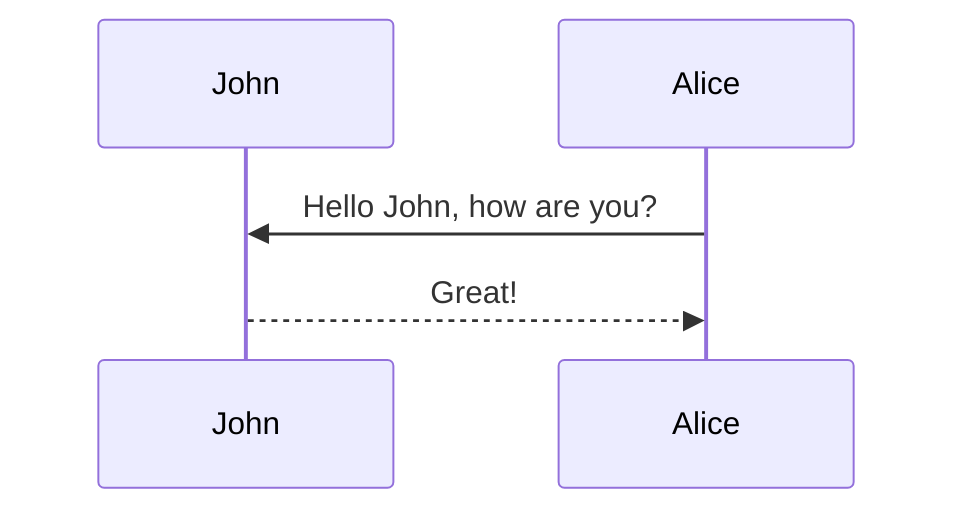


check the [bootstrap-toc](https://afeld.github.io/bootstrap-toc/) documentation. Notice that you can even customize the text of the heading that will be displayed on the sidebar.

# 1. 文本格式




```liquid


内容。内容


内容，内容


```






```pseudocode
% Ackermann Procedure
\begin{algorithm}
\caption{Ackermann Function}
\begin{algorithmic}
\PROCEDURE{Ackermann}{$m, n$}
    \IF{$m = 0$}
        \RETURN $n + 1$
    \ELSIF{$m > 0$ AND $n = 0$}
        \RETURN \CALL{Ackermann}{$m - 1, 1$}
    \ELSE
        \RETURN \CALL{Ackermann}{$m - 1, $ \CALL{Ackermann}{$m, n - 1$}} 
    \ENDIF
\ENDPROCEDURE
\end{algorithmic}
\end{algorithm}
```


```markdown
markdown[Pinterest](https://www.pinterest.com)  
html <a href="https://en.wikipedia.org/wiki/Cold-pressed_juice">cold-pressed</a> 
```


- [x] Brush Teeth
- [ ] Put on socks
  - [x] Put on left sock
  - [ ] Put on right sock


> A quote
```markdown
> A quote in markdown block
```


```markdown
- brunch
  - fixie
    - raybans
+ sdf 
+ sdfsdf
+ list
    1. sd 
    2. sdf 
 1. sdf 
a. sdf
```


```yaml
food:
  - "🥬"
  - "🍉"
```


```json
{
  "relationship": ["tiktok", "ByteDance"]
}
```


```liquid
{::nomarkdown}



  

  <p>Sorry, the notebook you are looking for does not exist.</p>

{:/nomarkdown}
```




- tabs子标签英文自动大写
- 使用`endtabs`作为结束标签
- 每个tab块都有两个属性（组名和标签名）
- ~~有效的标签名~~



- `pseudocode`会自动编号，如Algorithm 1, Algorithm 2, ...
- 使用四个反引号（````）来表示代码块是为了嵌套代码块，例：
````markdown
```pseudocode
% BusyBeaver 函数
\begin{algorithm}
\caption{Busy Beaver Function}
\begin{algorithmic}
\PROCEDURE{BusyBeaver}{$n$}
    \STATE $max\_steps \gets 0$
    \FORALL{图灵机 $T$ with $n$ states}
        \STATE $steps \gets$ \CALL{SimulateTuringMachine}{$T$}
        \IF{$steps > max\_steps$}
            \STATE $max\_steps \gets steps$
        \ENDIF
    \ENDFOR
    \RETURN $max\_steps$
\ENDPROCEDURE

\PROCEDURE{SimulateTuringMachine}{$T$}
    \STATE $current\_state \gets initial\_state$
    \STATE $tape \gets$ an infinite tape initialized to all $0$s
    \STATE $head\_position \gets 0$
    \STATE $steps \gets 0$
    \WHILE{$current\_state$ is not a halting state}
        \STATE $symbol \gets$ symbol at $tape[head\_position]$
        \STATE $action \gets$ action defined by $T$ for $current\_state$ and $symbol$
        \STATE $tape[head\_position] \gets$ action.write
        \STATE $head\_position \gets head\_position + action.move$
        \STATE $current\_state \gets$ action.next\_state
        \STATE $steps \gets steps + 1$
    \ENDWHILE
    \RETURN $steps$
\ENDPROCEDURE
\end{algorithmic}
\end{algorithm}
```
````



- 在`liquid`tag中代码块显示行数：

int main(int argc, char const \*argv[])
{
string myString;

    cout << "input a string: ";
    getline(cin, myString);
    int length = myString.length();

    char charArray = new char * [length];

    charArray = myString;
    for(int i = 0; i < length; ++i){
        cout << charArray[i] << " ";
    }

    return 0;

}

- `_config.yml`中`kramdown.syntax_highlighter_opts.block.line_numbers` 可调整
- 更详细信息见：[math](https://alshedivat.github.io/al-folio/blog/2015/math/)和[code](https://alshedivat.github.io/al-folio/blog/2015/code/)




水平线`<hr>`或者`<hr style="border: none; border-top: 2px solid #ccc; width: 50%;">`

<hr style="border: none; border-top: 2px solid #ccc; width: 50%;">

# 2.图片

- `thumbnail`是“封面图”
- 2/3,1/3的比例[亦可操作](https://alshedivat.github.io/al-folio/projects/1_project/)
- Adding `data-zoomable` to `` tags so that make images zoomable.


<div class="row mt-3">
    <div class="col-sm mt-3 mt-md-0">
        
    </div>
    <div class="col-sm mt-3 mt-md-0">
        
    </div>
    <div class="col-sm mt-3 mt-md-0">
        
    </div>
</div>
<div class="caption">
    图片显示 <em>一行</em> <strong>三列</strong>
</div>

## Image [Swiper](https://swiperjs.com/) 的[语法](https://alshedivat.github.io/al-folio/blog/2024/advanced-images/)

<swiper-container keyboard="true" navigation="true" pagination="true" pagination-clickable="true" pagination-dynamic-bullets="true" rewind="true">
  <swiper-slide></swiper-slide>
  <swiper-slide></swiper-slide>
  <swiper-slide></swiper-slide>
  <swiper-slide></swiper-slide>
  <swiper-slide></swiper-slide>
</swiper-container>
## [img-comparison-slider](https://img-comparison-slider.sneas.io/) 


  
  
</img-comparison-slider>

<hr style="border: none; border-top: 4px solid #ccc; width: 50%;">

# 3.图表



````markdown
```vega_lite
{
  "$schema": "https://vega.github.io/schema/vega-lite/v5.json",
  "description": "A dot plot showing each movie in the database, and the difference from the average movie rating. The display is sorted by year to visualize everything in sequential order. The graph is for all Movies before 2019.",
  "data": {
    "url": "https://raw.githubusercontent.com/vega/vega/main/docs/data/movies.json"
  },
  "transform": [
    {"filter": "datum['IMDB Rating'] != null"},
    {"filter": {"timeUnit": "year", "field": "Release Date", "range": [null, 2019]}},
    {
      "joinaggregate": [{
        "op": "mean",
        "field": "IMDB Rating",
        "as": "AverageRating"
      }]
    },
    {
      "calculate": "datum['IMDB Rating'] - datum.AverageRating",
      "as": "RatingDelta"
    }
  ],
  "mark": "point",
  "encoding": {
    "x": {
      "field": "Release Date",
      "type": "temporal"
    },
    "y": {
      "field": "RatingDelta",
      "type": "quantitative",
      "title": "Rating Delta"
    },
    "color": {
      "field": "RatingDelta",
      "type": "quantitative",
      "scale": {"domainMid": 0},
      "title": "Rating Delta"
    }
  }
}
```
````


````markdown
```chartjs
{
  "type": "doughnut",
  "data": {
    "labels": [
      "Red",
      "Blue",
      "Yellow"
    ],
    "datasets": [
      {
        "data": [
          300,
          50,
          100
        ],
        "backgroundColor": [
          "#FF6384",
          "#36A2EB",
          "#FFCE56"
        ],
        "hoverBackgroundColor": [
          "#FF6384",
          "#36A2EB",
          "#FFCE56"
        ]
      }
    ]
  },
  "options": {}
}
```
````


````markdown
```chartjs
{
  "type": "line",
  "data": {
    "labels": [
      "January",
      "February",
      "March",
      "April",
      "May",
      "June",
      "July"
    ],
    "datasets": [
      {
        "label": "# of bugs",
        "fill": false,
        "lineTension": 0.1,
        "backgroundColor": "rgba(75,192,192,0.4)",
        "borderColor": "rgba(75,192,192,1)",
        "borderCapStyle": "butt",
        "borderDash": [],
        "borderDashOffset": 0,
        "borderJoinStyle": "miter",
        "pointBorderColor": "rgba(75,192,192,1)",
        "pointBackgroundColor": "#fff",
        "pointBorderWidth": 1,
        "pointHoverRadius": 5,
        "pointHoverBackgroundColor": "rgba(75,192,192,1)",
        "pointHoverBorderColor": "rgba(220,220,220,1)",
        "pointHoverBorderWidth": 2,
        "pointRadius": 1,
        "pointHitRadius": 10,
        "data": [
          65,
          59,
          80,
          81,
          56,
          55,
          40
        ],
        "spanGaps": false
      }
    ]
  },
  "options": {}
}
```
````


````markdown
```typograms
+----+
|    |---> My first diagram!
+----+

.------------------------.
|.----------------------.|
||"https://example.com" ||
|'----------------------'|
| ______________________ |
||                      ||
||   Welcome!           ||
||                      ||
||                      ||
||  .----------------.  ||
||  | username       |  ||
||  '----------------'  ||
||  .----------------.  ||
||  |"*******"       |  ||
||  '----------------'  ||
||                      ||
||  .----------------.  ||
||  |   "Sign-up"    |  ||
||  '----------------'  ||
||                      ||
|+----------------------+|
.------------------------.
```
````


```markdown
<script type="text/tikz">
  \begin{tikzcd}
    A \arrow[r, "\phi"] \arrow[d, red]
      & B \arrow[d, "\psi" red] \\
    C \arrow[r, red, "\eta" blue]
      & |[blue, rotate=-15]| D
  \end{tikzcd}
</script>
```


````markdown

````



## [vega lite](https://vega.github.io/vega-lite/)的[语法](https://alshedivat.github.io/al-folio/blog/2024/vega-lite/)

```vega_lite
{
  "$schema": "https://vega.github.io/schema/vega-lite/v5.json",
  "description": "A dot plot showing each movie in the database, and the difference from the average movie rating. The display is sorted by year to visualize everything in sequential order. The graph is for all Movies before 2019.",
  "data": {
    "url": "https://raw.githubusercontent.com/vega/vega/main/docs/data/movies.json"
  },
  "transform": [
    {"filter": "datum['IMDB Rating'] != null"},
    {"filter": {"timeUnit": "year", "field": "Release Date", "range": [null, 2019]}},
    {
      "joinaggregate": [{
        "op": "mean",
        "field": "IMDB Rating",
        "as": "AverageRating"
      }]
    },
    {
      "calculate": "datum['IMDB Rating'] - datum.AverageRating",
      "as": "RatingDelta"
    }
  ],
  "mark": "point",
  "encoding": {
    "x": {
      "field": "Release Date",
      "type": "temporal"
    },
    "y": {
      "field": "RatingDelta",
      "type": "quantitative",
      "title": "Rating Delta"
    },
    "color": {
      "field": "RatingDelta",
      "type": "quantitative",
      "scale": {"domainMid": 0},
      "title": "Rating Delta"
    }
  }
}
```
another example:
```vega_lite
{
  "$schema": "https://vega.github.io/schema/vega-lite/v5.json",
  "data": {
      "url": "https://raw.githubusercontent.com/vega/vega/main/docs/data/seattle-weather.csv"
  },
  "title": "Daily Max Temperatures (C) in Seattle, WA",
  "config": {
      "view": {
          "strokeWidth": 0,
          "step": 13
      },
      "axis": {
          "domain": false
      }
  },
  "mark": "rect",
  "encoding": {
      "x": {
          "field": "date",
          "timeUnit": "date",
          "type": "ordinal",
          "title": "Day",
          "axis": {
              "labelAngle": 0,
              "format": "%e"
          }
      },
      "y": {
          "field": "date",
          "timeUnit": "month",
          "type": "ordinal",
          "title": "Month"
      },
      "color": {
          "field": "temp_max",
          "aggregate": "max",
          "type": "quantitative",
          "legend": {
              "title": null
          }
      }
  }
}
```

This plot supports both light and dark themes.
## [chart.js](https://www.chartjs.org/) 的[语法](https://alshedivat.github.io/al-folio/blog/2024/chartjs/)

```chartjs
{
  "type": "line",
  "data": {
    "labels": [
      "January",
      "February",
      "March",
      "April",
      "May",
      "June",
      "July"
    ],
    "datasets": [
      {
        "label": "# of bugs",
        "fill": false,
        "lineTension": 0.1,
        "backgroundColor": "rgba(75,192,192,0.4)",
        "borderColor": "rgba(75,192,192,1)",
        "borderCapStyle": "butt",
        "borderDash": [],
        "borderDashOffset": 0,
        "borderJoinStyle": "miter",
        "pointBorderColor": "rgba(75,192,192,1)",
        "pointBackgroundColor": "#fff",
        "pointBorderWidth": 1,
        "pointHoverRadius": 5,
        "pointHoverBackgroundColor": "rgba(75,192,192,1)",
        "pointHoverBorderColor": "rgba(220,220,220,1)",
        "pointHoverBorderWidth": 2,
        "pointRadius": 1,
        "pointHitRadius": 10,
        "data": [
          65,
          59,
          80,
          81,
          56,
          55,
          40
        ],
        "spanGaps": false
      }
    ]
  },
  "options": {}
}
```

Also another example chart.

```chartjs
{
  "type": "doughnut",
  "data": {
    "labels": [
      "Red",
      "Blue",
      "Yellow"
    ],
    "datasets": [
      {
        "data": [
          300,
          50,
          100
        ],
        "backgroundColor": [
          "#FF6384",
          "#36A2EB",
          "#FFCE56"
        ],
        "hoverBackgroundColor": [
          "#FF6384",
          "#36A2EB",
          "#FFCE56"
        ]
      }
    ]
  },
  "options": {}
}
```

## [echarts](https://echarts.apache.org/)的[语法](https://alshedivat.github.io/al-folio/blog/2024/echarts/)

````markdown
```echarts
{
  "title": {
    "text": "ECharts Getting Started Example"
  },
  "responsive": true,
  "tooltip": {},
  "legend": {
    "top": "30px",
    "data": ["sales"]
  },
  "xAxis": {
    "data": ["Shirts", "Cardigans", "Chiffons", "Pants", "Heels", "Socks"]
  },
  "yAxis": {},
  "series": [
    {
      "name": "sales",
      "type": "bar",
      "data": [5, 20, 36, 10, 10, 20]
    }
  ]
}
```
````

Which generates:

```echarts
{
  "title": {
    "text": "ECharts Getting Started Example"
  },
  "responsive": true,
  "tooltip": {},
  "legend": {
    "top": "30px",
    "data": ["sales"]
  },
  "xAxis": {
    "data": ["Shirts", "Cardigans", "Chiffons", "Pants", "Heels", "Socks"]
  },
  "yAxis": {},
  "series": [
    {
      "name": "sales",
      "type": "bar",
      "data": [5, 20, 36, 10, 10, 20]
    }
  ]
}
```

Note that this library offer support for both light and dark themes.

## [typograms](https://google.github.io/typograms/)的[语法](https://alshedivat.github.io/al-folio/blog/2024/typograms/)

```typograms
+----+
|    |---> My first diagram!
+----+

.------------------------.
|.----------------------.|
||"https://example.com" ||
|'----------------------'|
| ______________________ |
||                      ||
||   Welcome!           ||
||                      ||
||                      ||
||  .----------------.  ||
||  | username       |  ||
||  '----------------'  ||
||  .----------------.  ||
||  |"*******"       |  ||
||  '----------------'  ||
||                      ||
||  .----------------.  ||
||  |   "Sign-up"    |  ||
||  '----------------'  ||
||                      ||
|+----------------------+|
.------------------------.
```
## [TikZJax](https://tikzjax.com/)的[语法](https://alshedivat.github.io/al-folio/blog/2023/tikzjax/)
<script type="text/tikz">
  \begin{tikzcd}
    A \arrow[r, "\phi"] \arrow[d, red]
      & B \arrow[d, "\psi" red] \\
    C \arrow[r, red, "\eta" blue]
      & |[blue, rotate=-15]| D
  \end{tikzcd}
</script>

## [Mermaid](https://mermaid-js.github.io/mermaid/){:target="\_blank"}的[语法](https://alshedivat.github.io/al-folio/blog/2021/diagrams/)


<hr style="border: none; border-top: 4px solid #333; width: 50%;">

# 4.表格的[语法](https://alshedivat.github.io/al-folio/blog/2023/tables/)
## Simple Example

First, add the following to the post's front matter

Then, the following syntax

```markdown
| Left aligned | Center aligned | Right aligned |
| :----------- | :------------: | ------------: |
| Left 1       |    center 1    |       right 1 |
| Left 2       |    center 2    |       right 2 |
| Left 3       |    center 3    |       right 3 |
```

will generate

| Left aligned | Center aligned | Right aligned |
| :----------- | :------------: | ------------: |
| Left 1       |    center 1    |       right 1 |
| Left 2       |    center 2    |       right 2 |
| Left 3       |    center 3    |       right 3 |

<p></p>

## HTML Example

It is also possible to use HTML to display tables. For example, the following HTML code will display a table with [Bootstrap Table](https://bootstrap-table.com/), loaded from a JSON file:



```html
<table id="table" data-toggle="table" data-url="{{ '/assets/json/table_data.json' | relative_url }}">
  <thead>
    <tr>
      <th data-field="id">ID</th>
      <th data-field="name">Item Name</th>
      <th data-field="price">Item Price</th>
    </tr>
  </thead>
</table>
```



<table
  data-toggle="table"
  data-url="{{ '/assets/json/table_data.json' | relative_url }}">
  <thead>
    <tr>
      <th data-field="id">ID</th>
      <th data-field="name">Item Name</th>
      <th data-field="price">Item Price</th>
    </tr>
  </thead>
</table>

<p></p>

## More Complex Example

By using [Bootstrap Table](https://bootstrap-table.com/) it is possible to create pretty complex tables, with pagination, search, and more. For example, the following HTML code will display a table, loaded from a JSON file, with pagination, search, checkboxes, and header/content alignment. For more information, check the [documentation](https://examples.bootstrap-table.com/index.html).



```html
<table
  data-click-to-select="true"
  data-height="460"
  data-pagination="true"
  data-search="true"
  data-toggle="table"
  data-url="{{ '/assets/json/table_data.json' | relative_url }}"
>
  <thead>
    <tr>
      <th data-checkbox="true"></th>
      <th data-field="id" data-halign="left" data-align="center" data-sortable="true">ID</th>
      <th data-field="name" data-halign="center" data-align="right" data-sortable="true">Item Name</th>
      <th data-field="price" data-halign="right" data-align="left" data-sortable="true">Item Price</th>
    </tr>
  </thead>
</table>
```



<table
  data-click-to-select="true"
  data-height="460"
  data-pagination="true"
  data-search="true"
  data-toggle="table"
  data-url="{{ '/assets/json/table_data.json' | relative_url }}">
  <thead>
    <tr>
      <th data-checkbox="true"></th>
      <th data-field="id" data-halign="left" data-align="center" data-sortable="true">ID</th>
      <th data-field="name" data-halign="center" data-align="right" data-sortable="true">Item Name</th>
      <th data-field="price" data-halign="right" data-align="left" data-sortable="true">Item Price</th>
    </tr>
  </thead>
</table>


# 5. 音视频的[语法](https://alshedivat.github.io/al-folio/blog/2023/videos/)
<div class="row mt-3">
    <div class="col-sm mt-3 mt-md-0">
        
    </div>
    <div class="col-sm mt-3 mt-md-0">
        
    </div>
</div>
<div class="caption">
    A simple, elegant caption looks good between video rows, after each row, or doesn't have to be there at all.
</div>

<div class="row mt-3">
    <div class="col-sm mt-3 mt-md-0">
        
    </div>
    <div class="col-sm mt-3 mt-md-0">
        
    </div>
</div>
<div class="caption">
    A simple, elegant caption looks good between video rows, after each row, or doesn't have to be there at all.
</div>

It does also support embedding videos from different sources. Here are some examples:

<div class="row mt-3">
    <div class="col-sm mt-3 mt-md-0">
        
    </div>
    <div class="col-sm mt-3 mt-md-0">
        
    </div>
</div>

# 6. 其他特殊格式：

## jupyter nb的[语法](https://alshedivat.github.io/al-folio/blog/2023/jupyter-notebook/)
【暂略】

## redirect链接
adding the following to the post’s front matter
```yaml
---
layout: post
redirect: /assets/pdf/example_pdf.pdf
---
```
## Blockquote的[语法](https://alshedivat.github.io/al-folio/blog/2023/custom-blockquotes/)
This post shows how to add custom styles for blockquotes. Based on [jekyll-gitbook](https://github.com/sighingnow/jekyll-gitbook) implementation.

We decided to support the same custom blockquotes as in [jekyll-gitbook](https://sighingnow.github.io/jekyll-gitbook/jekyll/2022-06-30-tips_warnings_dangers.html), which are also found in a lot of other sites' styles. The styles definitions can be found on the [\_base.scss](https://github.com/alshedivat/al-folio/blob/master/_sass/_base.scss) file, more specifically:

```scss
/* Tips, warnings, and dangers */
.post .post-content blockquote {
  &.block-tip {
    border-color: var(--global-tip-block);
    background-color: var(--global-tip-block-bg);

    p {
      color: var(--global-tip-block-text);
    }

    h1,
    h2,
    h3,
    h4,
    h5,
    h6 {
      color: var(--global-tip-block-title);
    }
  }

  &.block-warning {
    border-color: var(--global-warning-block);
    background-color: var(--global-warning-block-bg);

    p {
      color: var(--global-warning-block-text);
    }

    h1,
    h2,
    h3,
    h4,
    h5,
    h6 {
      color: var(--global-warning-block-title);
    }
  }

  &.block-danger {
    border-color: var(--global-danger-block);
    background-color: var(--global-danger-block-bg);

    p {
      color: var(--global-danger-block-text);
    }

    h1,
    h2,
    h3,
    h4,
    h5,
    h6 {
      color: var(--global-danger-block-title);
    }
  }
}
```

A regular blockquote can be used as following:

```markdown
> This is a regular blockquote
> and it can be used as usual
```

> This is a regular blockquote
> and it can be used as usual

These custom styles can be used by adding the specific class to the blockquote, as follows:

<!-- prettier-ignore-start -->

```markdown
> ##### TIP
>
> A tip can be used when you want to give advice
> related to a certain content.
{: .block-tip }
```

> ##### TIP
>
> A tip can be used when you want to give advice
> related to a certain content.
{: .block-tip }

```markdown
> ##### WARNING
>
> This is a warning, and thus should
> be used when you want to warn the user
{: .block-warning }
```

> ##### WARNING
>
> This is a warning, and thus should
> be used when you want to warn the user
{: .block-warning }

```markdown
> ##### DANGER
>
> This is a danger zone, and thus should
> be used carefully
{: .block-danger }
```

> ##### DANGER
>
> This is a danger zone, and thus should
> be used carefully
{: .block-danger }

<!-- prettier-ignore-end -->

## [geojson](https://geojson.org/)的[语法](https://alshedivat.github.io/al-folio/blog/2024/geojson-map/)

````markdown
```geojson
{
  "type": "FeatureCollection",
  "features": [
    {
      "type": "Feature",
      "properties": {},
      "geometry": {
        "coordinates": [
          [
            [
              -60.11363029935569,
              -2.904625022183211
            ],
            [
              -60.11363029935569,
              -3.162613728707967
            ],
            [
              -59.820894493858034,
              -3.162613728707967
            ],
            [
              -59.820894493858034,
              -2.904625022183211
            ],
            [
              -60.11363029935569,
              -2.904625022183211
            ]
          ]
        ],
        "type": "Polygon"
      }
    }
  ]
}
```
````

Which generates:

```geojson
{
  "type": "FeatureCollection",
  "features": [
    {
      "type": "Feature",
      "properties": {},
      "geometry": {
        "coordinates": [
          [
            [
              -60.11363029935569,
              -2.904625022183211
            ],
            [
              -60.11363029935569,
              -3.162613728707967
            ],
            [
              -59.820894493858034,
              -3.162613728707967
            ],
            [
              -59.820894493858034,
              -2.904625022183211
            ],
            [
              -60.11363029935569,
              -2.904625022183211
            ]
          ]
        ],
        "type": "Polygon"
      }
    }
  ]
}
```


## code diff [语法](https://alshedivat.github.io/al-folio/blog/2024/code-diff/)
【暂略】

## twitter[语法](https://alshedivat.github.io/al-folio/blog/2021/diagrams/)
【暂略】